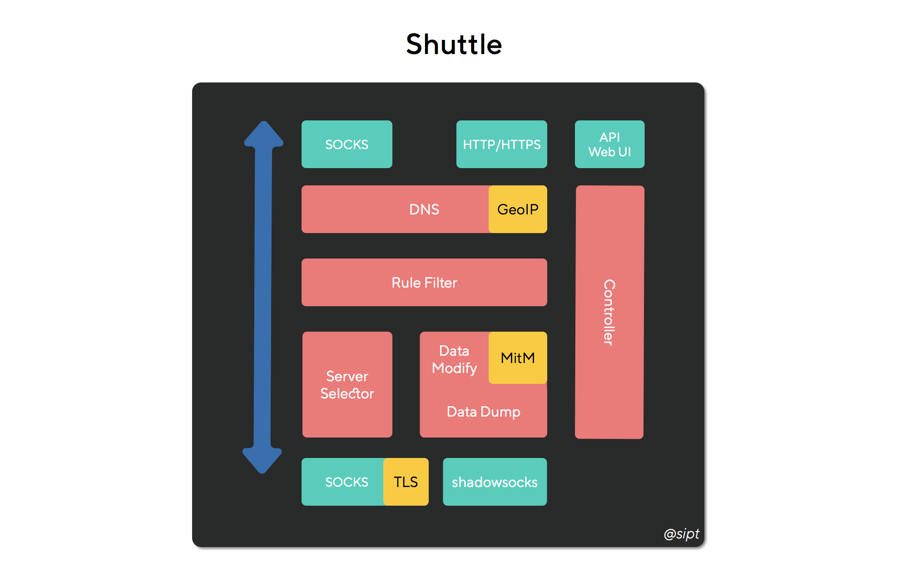
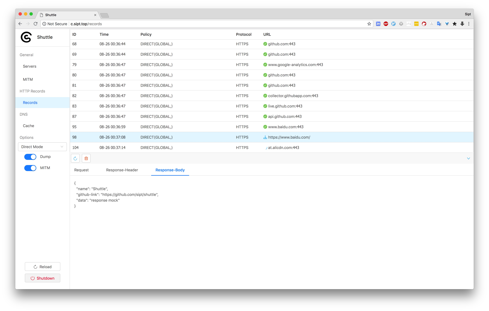
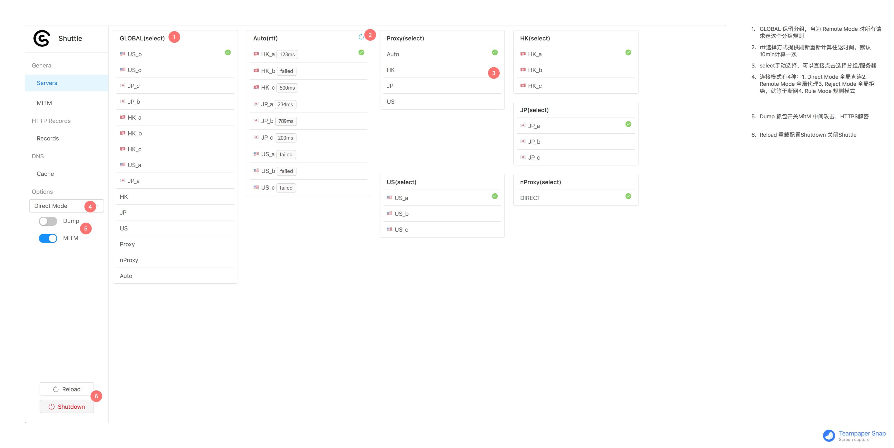
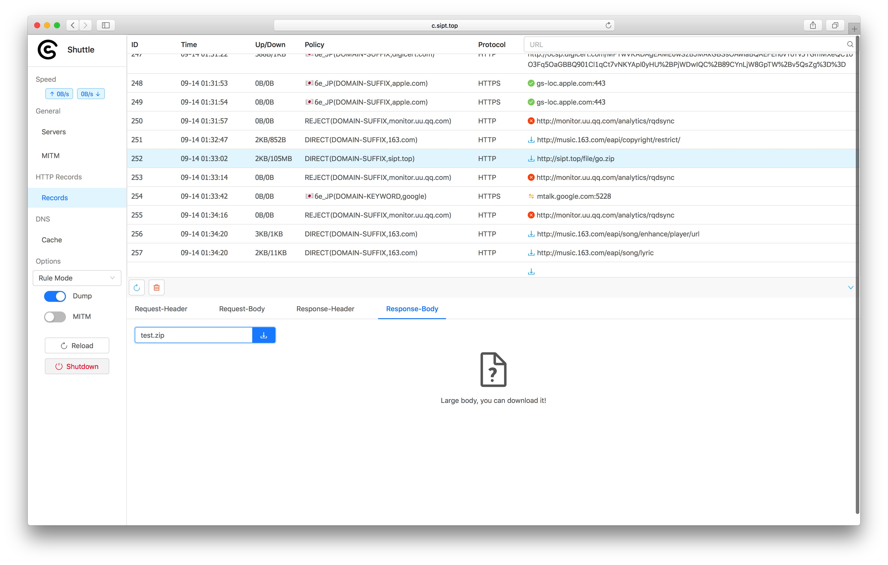

# Shuttle

**Shuttle** is a **cross-platform** network proxy tool based on Go. Feel free to join our [Slack](https://join.slack.com/t/shuttle-talk/shared_invite/enQtNDMxNTQyNTIwODcwLTcyNTc0NmU4MzJhOTEzNTMwYWJlMGM1NDE2OTA2OWNmZDRlM2M0MjYxNjgzMTc1YWRhOTA4MTAzNTRkZDM0NDc) or [Telegram](https://t.me/joinchat/GrRxoBJXAKTdZBrTIJfIbQ).
（logo created by **@不二**）


- [中文文档](README_zh.md)
- [Introduction](#introduction)
- [Features](#features)
- [Installation & Launch](#installation--launch)
  - [macOS](#macos)
  - [Windows](#windows)
  - [Linux](#linux)
- [Configuration](#configuration)
  - [Version](#version)
  - [General Settings](#general-settings)
  - [Proxy Settings](#proxy-settings)
  - [DNS](#dns)
  - [Request/Response Modification & URL Rewrite](#request/response-modification--url-rewrite)
  - [MitM](#mitm)
  - [Rule Configuration](#rule-configuration)
- [API](static/API.md)
- [Web Dashboard](#web_dashboard)
  - [Servers](#servers)
  - [DNS Cache](#dns-cache)
  - [Records](#records)
  - [Traffic Capture](#traffic-capture)

(Translated by [wao1201](https://github.com/wao1201), reviewed by [Joe Hill](https://github.com/Joe-Hill).)

## Introduction

Shuttle is a cross-platform network proxy tool based on Go.

*  `SOCKS5`、`SOCKS5 over TLS`、`shadowsocks` protocols supported.
* Proxying via rules: domain, IP CIDR and GEO-IP.
* Customized policy: direct, reject and proxy.
* Multiple proxy servers selection and grouping management. The policy of servers selection can be RTT(Round-trip time) or manual select.
* HTTP/HTTPS traffic capture, reverse proxy, request head modification, response head modification and fake return value supported.
* DNS parsing types: static, direct, remote.

Module Structure:



Screenshots:



## Features
- [ ] Proxy type
  - [x] TCP(HTTP/HTTPS)
  - [ ] UDP
- [x] HTTP/HTTPS request extension
  - [x] Traffic capture (MITM supported)
  - [x] URL rewrite
  - [x] Request/response modification
  - [x] Request mapping
- [x] Remote servers management
  - [x] Server grouping
  - [x] Protocols supported
    - [x] shadowsocks
    - [x] SOCKS5
    - [x] SOCKS5 over TLS
  - [x] Grouping server selection policy
    - [x] RTT
    - [x] Manual select
- [x] Outbound Mode
  - [x] Global, direct and reject
  - [x] Rules
    - [x] DOMAIN: full name match
    - [x] DOMAIN-SUFFIX: suffix match
    - [x] DOMAIN-KEYWORD: keyword match
    - [x] IP-CIDR: IP range match
    - [x] GEO-IP: GEO-IP route supported
- [x] DNS parsing type
  - [x] static：static address mapping
  - [x] direct：local DNS resolve
  - [x] remote：remote server DNS resolve (prevent DNS Cache Poisoning)
- [x] External module
  - [x] API ( see API document for details)
  - [x] Web UI
    - [x] Web UI (angular6 + ant design)

## Installation & Launch

### macOS

#### Preparation

Download the zip file from release and unzip it. The Folder structure is shown below.

```shell
shuttle
   ├── RespFiles/ #mock file directory
   ├── shuttle  #shuttle main executable
   ├── shuttle.yaml #config file
   └── start.sh #launch script

```

Open the config file, `shuttle.yaml`. Make sure all the ports are all configured correctly before launching. The default ports in config file are `8080`, `8081` and  `8082`.

```yaml
General:
  http-port: "8080"  #http/https port
  socks-port: "8081" #socks port
  controller-port: "8082" #dashboard port
```

#### Launch

Go to the shuttle directory and enter the command below in terminal/CMD to launch the app.

```shell
./start.sh #no output
```

Open your browser and visit  `http://localhost:8082` (For example, use the default settings `controller-port: "8082"`). The application has already run successfully if you can visit the dashboard on your browser.  Otherwise check the `shuttle.log` for more details and new issues anytime.

#### System Configuration

If you can visit  `http://c.sipt.top` on your browser, you can skip the following steps directly.

Open System Preference  => Network => Advanced => Proxy，there are 3 main options:

* `Web Proxy（HTTP）` set to `127.0.0.1:8080` (for example, `http-port: "8080"`)
* `Web Proxy（HTTPS）`  set to `127.0.0.1:8080`（for example,  `http-port: "8080"`）
* `SOCKS Proxy` set to `127.0.0.1:8080`（for example,  `socks-port: "8081"`）

Press `OK` and click `Apply`. The proxy settings are working if you can see the dashboard by visiting `http://c.sipt.top` on browser.

Enter the following commands to make Terminal.app go through proxies:

```shell
export https_proxy="http://127.0.0.1:8080"
export http_proxy="http://127.0.0.1:8080"
export all_proxy="socks5://127.0.0.1:8081"
```

### Windows

#### Preparation

Download the zip file from release and unzip it. The Folder structure is shown below.

```
shuttle
   ├── RespFiles/ #mock file directory
   ├── shuttle  #shuttle main executable
   ├── shuttle.yaml #config file
   └── startup.bat #launch script

```

Open the config file, `shuttle.yaml`. Make sure all the ports are all configured correctly before launching. The default ports in config file are `8080`, `8081` and  `8082`.

```yaml
General:
  http-port: "8080"  #http/https port
  socks-port: "8081" #socks port
  controller-port: "8082" #dashboard port
```

#### Launch

Double-click `startup.bat`, there will be no output on screen. Open your browser and visit  `http://localhost:8082` (For example, use the default settings `controller-port: "8082"`). The application has already run successfully if you can visit the dashboard on your browser.  Otherwise check the `shuttle.log` for more details and new issues anytime.

#### System Configuration

If you could open `http://c.sipt.top` in your browser, you can skip the following steps directly.

Open System Preference  => Network => Proxy, set to `127.0.0.1:8080`（for example: `http-port: "8080"`）. The proxy settings are working if you can see the dashboard by visiting `http://c.sipt.top` on browser.

### Linux

#### Preparation

Download the zip file from release and unzip it. The Folder structure is shown below.

```
shuttle
   ├── RespFiles/ #mock file directory
   ├── shuttle  #shuttle main executable
   ├── shuttle.yaml #config file
   └── start.sh #launch script

```

Open the config file, `shuttle.yaml`. Make sure all the ports are all configured correctly before launching. The default ports in config file are `8080`, `8081` and  `8082`.

```yaml
General:
  http-port: "8080"  #http/https port
  socks-port: "8081" #socks port
  controller-port: "8082" #dashboard port
```

#### Launch

Go to the shuttle directory and enter the command below in terminal/CMD to launch the app.

```shell
./start.sh #no output
```

Open your browser and visit  `http://localhost:8082` (For example, use the default settings `controller-port: "8082"`). The application has already run successfully if you can visit the dashboard on your browser.  Otherwise check the `shuttle.log` for more details and new issues anytime.

## Configuration

### Version

```yaml
ver: v1.0.1
```

Current config file only supports `v1.0.1`. Don't edit yourself.

### General Settings

```yaml
General:
  loglevel: "info"
  dns-server:
  - "114.114.114.114"
  - "223.5.5.5"
  http-port: "8080"
  http-interface: "0.0.0.0"
  socks-port: "8081"
  socks-interface: "0.0.0.0"
  controller-port: "8082"
  controller-interface: "0.0.0.0"
```

| Name                 | Description                                       | Value                  |
| -------------------- | ------------------------------------------------- | ---------------------- |
| loglevel             | Log output level, better use level: info or error | trace,debug,info,error |
| dns-server           | DNS server address                                | IP address             |
| http-port            | HTTP/HTTPS port                                   |                        |
| http-interface       | HTTP/HTTPS port                                   |                        |
| socks-port           | SOCKS port                                        |                        |
| socks-interface      | SOCKS control                                     |                        |
| controller-port      | dashboard port                                    |                        |
| controller-interface | dashboard control                                 |                        |

### Proxy Settings

Server name and server group name should not be repeating. **DIRECT**, **REJECT** and **GLOBAL** are reserved name.

#### Server

```yaml
Proxy:
  "🇯🇵JP_a": ["ss", "jp.a.example.com", "12345", "rc4-md5", "123456"]
  "🇯🇵JP_b": ["ss", "jp.b.example.com", "12345", "rc4-md5", "123456"]
  "🇯🇵JP_c": ["ss", "jp.c.example.com", "12345", "rc4-md5", "123456"]
  "🇭🇰HK_a": ["ss", "hk.a.example.com", "12345", "rc4-md5", "123456"]
  "🇭🇰HK_b": ["ss", "hk.b.example.com", "12345", "rc4-md5", "123456"]
  "🇭🇰HK_c": ["ss", "hk.c.example.com", "12345", "rc4-md5", "123456"]
  "🇺🇸US_a": ["ss", "us.a.example.com", "12345", "rc4-md5", "123456"]
  "🇺🇸US_b": ["ss", "us.b.example.com", "12345", "rc4-md5", "123456"]
  "🇺🇸US_c": ["ss", "hk.c.example.com", "12345", "rc4-md5", "123456"]
  "socks": ["socks", "localhost", "12345"]
  "socks-tls": ["socks-tls", "localhost", "12345", "skip-verify"]
  "socks-auth": ["socks", "localhost", "12345", "user", "password"]
  "socks-tls-auth": ["socks-tls", "localhost", "12345", "skip-verify", "user", "password"]
  ...
```

Server protocols:

* ss: shadowsocks; 

  format：

  ```yaml
  "server name": ["ss", "domain/IP", "port", "cipher", "password"]
  ```

  Current supported encryption methods:

  * [x] aes-128-cfb
  * [x] aes-192-cfb
  * [x] aes-256-cfb
  * [x] aes-128-ctr
  * [x] aes-192-ctr
  * [x] aes-256-ctr
  * [x] des-cfb
  * [x] bf-cfb
  * [x] cast5-cfb
  * [x] rc4-md5
  * [x] chacha20
  * [x] chacha20-ietf
  * [x] salsa20
  * [x] aes-256-gcm
  * [x] aes-192-gcm
  * [x] aes-128-gcm
  * [x] chacha20-ietf-poly1305

* socks: SOCKS5;

  Support username/password authentication.

  ```yaml
  "server name": ["socks", "domain/IP", "port"] 
  "server name": ["socks", "domain/IP", "port", "username", "password"]
  ```

* socks-tls: SOCKS5 over TLS;

  Support username/password authentication. Use: `skip-verify` or `verify` for checking server's certificate.

  ```yaml
  "server name": ["socks-tls", "domain/IP", "ca check or not", "port"] 
  "server name": ["socks-tls", "domain/IP", "ca check or not", "port", "username", "password"]
  ```

#### Server Group

```yaml
Proxy-Group:
  "Auto": ["rtt", "🇭🇰HK_a", "🇭🇰HK_b", "🇭🇰HK_c", "🇯🇵JP_a", "🇯🇵JP_b", "🇯🇵JP_c", "🇺🇸US_a", "🇺🇸US_b", "🇺🇸US_c"]
  "HK": ["select", "🇭🇰HK_a", "🇭🇰HK_b", "🇭🇰HK_c"]
  "JP": ["select", "🇯🇵JP_a", "🇯🇵JP_b", "🇯🇵JP_c"]
  "US": ["select", "🇺🇸US_a", "🇺🇸US_b", "🇺🇸US_c"]
  "Proxy": ["select", "Auto", "HK", "JP", "US"]
  "nProxy": ["select", "DIRECT"]
```

Format

```yaml
"group name": ["option", "server name/server group name", ... ]
```

| Option | Description                                                  |
| ------ | ------------------------------------------------------------ |
| select | manual select                                                |
| rtt    | select the server that has the shortest transaction time between local(through remote server) to `www.gstatic.com` |

### DNS

```yaml
Local-DNS:
- ["DOMAIN", "localhost", "static", "127.0.0.1"]
- ["DOMAIN-KEYWORD", "google", "remote", ""]
- ["DOMAIN-SUFFIX", "baidu.com", "direct", "114.114.114.114"]
```

Format

```yaml
- ["match option", "value", "resolve method", "parameter"]
```

| Match Option   | Description          | Value         |
| -------------- | -------------------- | ------------- |
| DOMAIN-SUFFIX  | match domain suffix  | domain suffix |
| DOMAIN         | match domain         | domain        |
| DOMAIN-KEYWORD | match domain keyword | keyword       |

| Resolve Option | Description                  | Parameter               |
| -------------- | ---------------------------- | ----------------------- |
| static         | static resolve               | corresponding IP adress |
| direct         | use DNS to resolve           | DNS address             |
| remote         | use remote server to resolve | N/A                     |

### Request/Response Modification & URL Rewrite

**HTTPS**(turn the MitM on)

```yaml
Http-Map:
  Req-Map: #request modification config
    - url-rex: "^http://www.zhihu.com"
      type: "UPDATE"
      items:
        - ["HEADER", "Scheme", "http"]
  Resp-Map: #response modification config
      - url-rex: "^http://www.zhihu.com"
      type: "UPDATE"
      items:
         - ["STATUS", "", "301"]
         - ["HEADER", "Location", "http://www.jianshu.com"]
```

| Name    | Description                                                  |
| ------- | ------------------------------------------------------------ |
| url-rex | Use regex to match requested URL                             |
| type    | `UPDATE`（modification）and `MOCK`(local data return)，(`Resp-Map`only supports`UPDATE`) |
| items   | An array:  `["modify type", "Key", "Value"]` (details on the following table) |

| Modify Type | Description                                                  | Condition                                       |
| ----------- | ------------------------------------------------------------ | ----------------------------------------------- |
| HEADER      | Add/modify header ([Example](#header-modify))                | (`Req-Map`or`Resp-Map`) type:(`UPDATE`or`MOCK`) |
| STATUS      | Modify return status code ([Example](#request-mapping))      | (`Resp-Map`) type:(`UPDATE`or`MOCK`)            |
| BODY        | Response Body([Example](#request-mapping))<br />(HTTPS domain must exists and supports HTTPS) | (`Resp-Map`) type:(`MOCK`)                      |
| URL         | Use `url-rex` to replace `URL`，<br />**Currently, HTTPS is not supported** ([URL Rewrite](#url-rewrite)) | (`Req-Map`) type:(`UPDATE`)                     |

#### Examples：

##### Header Modify

Add `Scheme: http` to every request that matches `^http://www.zhihu.com`

```yaml
Http-Map:
  Req-Map:
      - url-rex: "^http://www.zhihu.com"
      type: "UPDATE"
      items:
        - ["HEADER", "Scheme", "http"]
```

##### Request Mapping

**If the type is MOCK, all HTTP domains are good to go but HTTPS domains must exist and support HTTPS**

For every request that matches `^http://www.baidu.com/$`, return directly.

```json
{
  "name": "Shuttle",
  "github-link": "https://github.com/sipt/shuttle",
  "data": "response mock"
}
```

Create a file called `mocks.json` to write in the data above under `RespFiles` directory.

Config：

```yaml
Http-Map:
  Req-Map:
    - url-rex: "^http://www.wogaoxing.abcascb" #all HTTP domains are good to go
      type: "MOCK"
      items:
        - ["STATUS", "", "200"] #return status code：200 OK
        - ["HEADER", "Content-Type", "application/json"] #add header
        - ["BODY", "", "mock.json"] #return data matches RespFiles/mock.json
    - url-rex: "^https://www.baidu.com" #For HTTPS, domains must exist and support HTTPS
      type: "MOCK"
      items:
        - ["STATUS", "", "200"] #return status code：200 OK
        - ["HEADER", "Content-Type", "application/json"] #add header
        - ["BODY", "", "mock.json"] #return data matches RespFiles/mock.json
```

##### URL Rewrite

**HTTPS is not supported currently**

For every request that matches `^http://www.baidu.com`, use reverse proxy to redirect to `http://www.zhihu.com`：

```yaml
Http-Map:
  Req-Map:
    - url-rex: "^http://www.baidu.com"
      type: "UPDATE"
      items:
       - ["URL", "", "http://www.zhihu.com"]
```

### MitM

```yaml
MITM: 
  rules: ["*.baidu.com", "*.zhihu.com"] #Domains allowed for MitM
  ca: (base64) # CA certificate and private key, no need for configuration, Shuttle will generate them automatically and store here
  key: (base64)
```

### Rule Configuration

```yaml
Rule: # Proxy rules
- ["DOMAIN-SUFFIX", "gitlab.anjian.com", "DIRECT", ""]
# - [Match full domain，domain，go through Proxy group，]
- ["DOMAIN", "sipt.top", "Proxy", ""]
# - [keyword match，keyword，connection reject，]
- ["DOMAIN-KEYWORD", "zjtoolbar", "REJECT", ""]
# - [IP range match，IP range，direct connection，]
- ["IP-CIDR", "127.0.0.0/8", "DIRECT", ""]
# - [GEOIP match，China， go through nProxy group，]
- ["GEOIP", "CN", "nProxy", ""]
# - [match none of above，， go through Proxy group，]
- ["FINAL", "", "Proxy", ""]
```

Format.

```yaml
- ["match option"，"value"，"connection type"，"memo"]
```

| Match Option   | Description            | Value         |
| -------------- | ---------------------- | ------------- |
| DOMAIN-SUFFIX  | match domain suffix    | domain suffix |
| DOMAIN         | match full domain name | domain        |
| DOMAIN-KEYWORD | match domain keyword   | keyword       |
| IP-CIDR        | match IP range         | IP range      |
| GEOIP          | GEOIP match            | country code  |
| FINAL          | match none of above    | N/A           |

| Connection Type   | Description                        |
| ----------------- | ---------------------------------- |
| DIRECT            | connect designated server directly |
| REJECT            | connection rejected                |
| Server name       |                                    |
| Server group name |                                    |

## Web Dashboard

http://c.sipt.top

### Servers



1. GLOBAL group was created by Shuttle. It will be selected in "Remote Mode".
2. Refresh RTT-Time.
3. Check new.
4. Up/Down speed.
5. Outbound Mode: Rule Mode, Remote Mode, Direct Mode, Reject Mode.
6. Dump: Capturing HTTP requests; MitM: Man-in-the-MiddleAttack.
7. Reload the config file. Shutdown the Shuttle.

### DNS Cache


Check all DNS records
The Refresh button and Clear button is on the left-hand corner. The Refresh button currently only support all records refresh.

### Records


Check all request, and the corresponding rule.
Currently, only the latest 500 entries will be stored, and keyword filter is supported

### Traffic Capture

You can enable Dump for HTTP traffic capture. All the Dumped Data would show the DOWNLOAD icon the every records. You can click and see for more detail.

It's a little bit complicated for HTTPS traffic capture. You can follow the steps to try it out.


1. Generate a certificate. A new CA would be generated and stored in the config file when you click the GENERATE button each time.
2. Click DOWNLOAD button to download the CA.
3. Add the CA to system and trust the CA.
4. The table above will list all HTTPS traffic that could be captured based on rules. You can add yourt own rules. Shuttle will not capture the HTTPS traffic matched no rules..
5. You should enable both Dump and MitM to make HTTPS traffic capture available.

Large file download



Enter the file name in the input filed, then click download.

The dumped data just shows "The file is too large" instead of data detail for the better webpage performance when the file data size is over 2MB. You can download it for more details.


### Build from source
```sh
go get -d github.com/sipt/shuttle
cd $GOPATH/src/github.com/sipt/shuttle/assets
go generate # package html and GeoLite2-Country.mmdb resources into assets/assets.go
cd $GOPATH/src/github.com/sipt/shuttle/cmd
go build -tags release
```