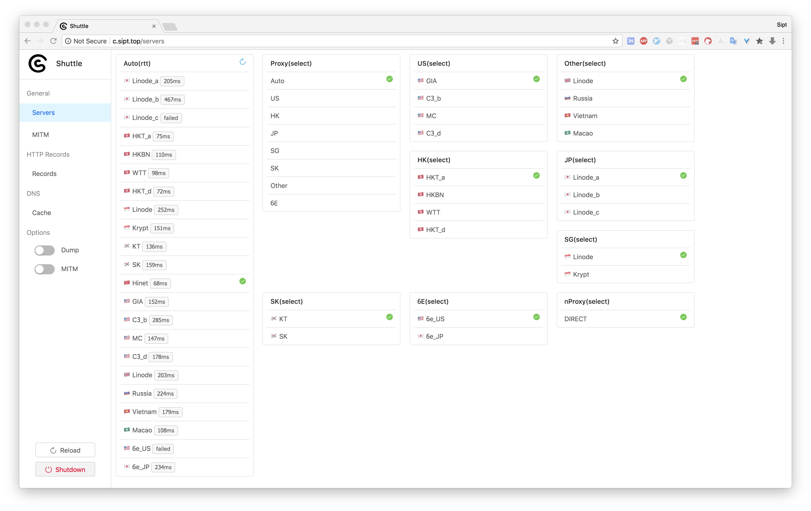
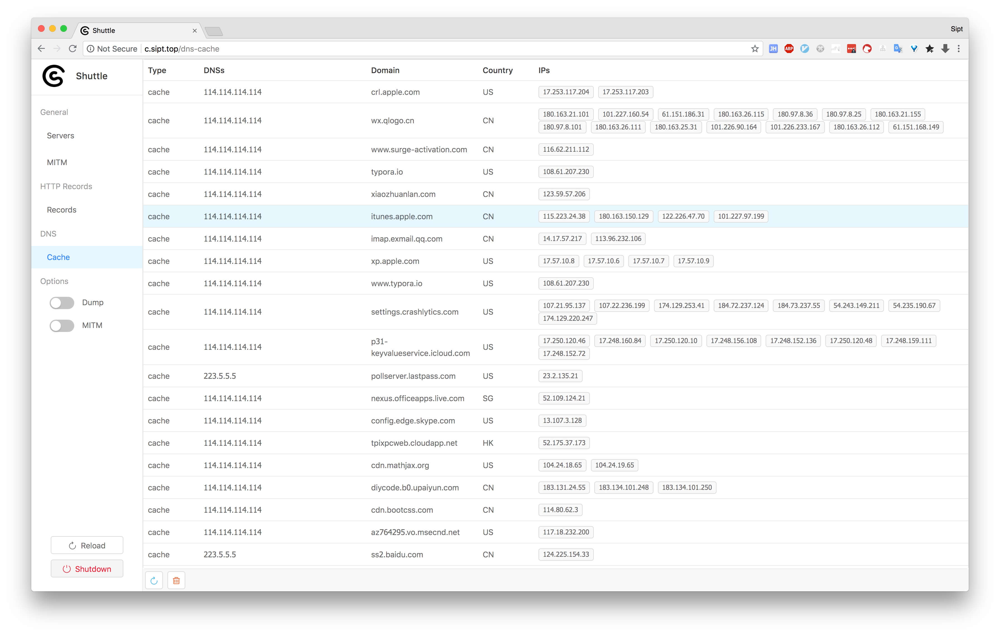
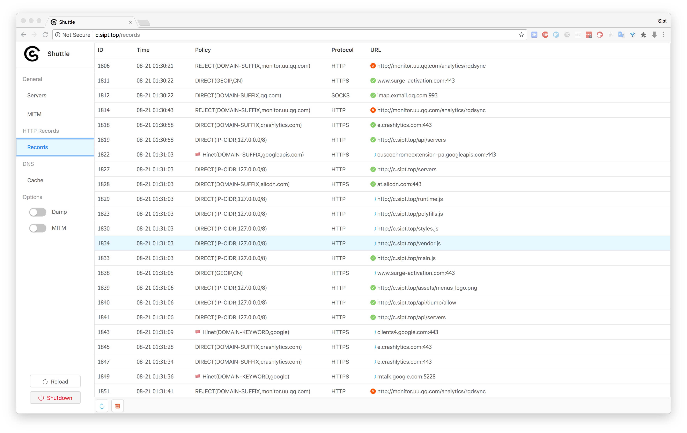
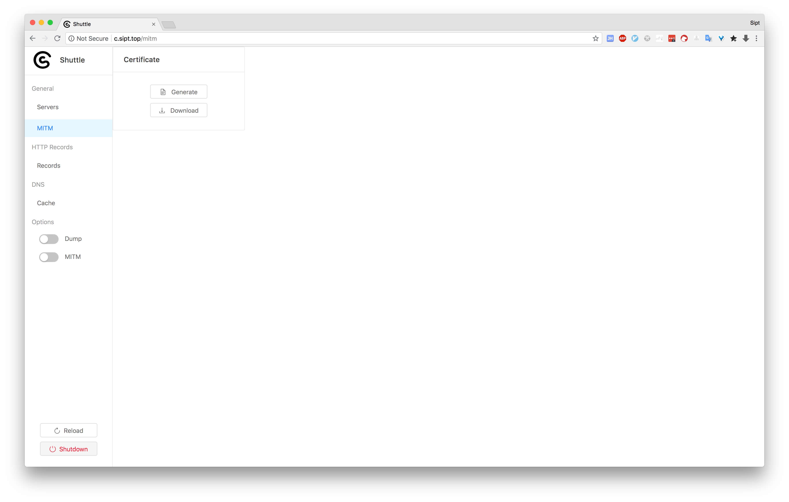
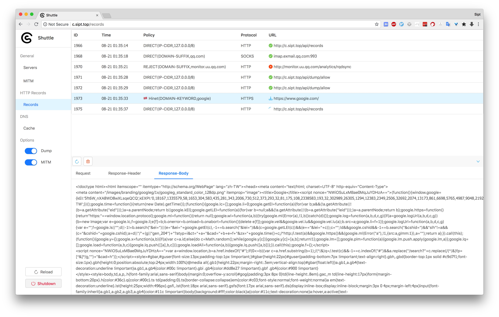

## 很简陋的Web UI
启动Shuttle后，并把它设置成http/https/socks代理。
此时web ui可以通过`c.sipt.top`访问，如果没有那就还是localhost加上配置文件中的`controller-port`进行访问。

### 1.Servers

- select方法，可以手动选择服务器
- rtt方法，提供卡片右上角刷新按钮，重新计算往返时间

### 2.DNS Cache

查看当前系统的入网所有域名的DNS解析
左下角提供刷新和清空按钮，目前还只支持全量刷新

### 3.Records

查看当前系统的入网所有请求，匹配了哪条规则等
当前只会保留1000条数据，

### 4.Cert

Generate生成证书，每次点击都会生成新的CA证书，生成完成后并保存到配置文件。
点击Download按钮下载下来，加入到系统证书里，并信任它，这样才成进行下一步的HTTPS截包(MITM)。

### 5.Dump

可以在左侧开启Dump和MITM, Dump只截HTTP，要想截HTTPS要Dump和MITM同时打开
左下角Reload按钮：重新加载配置文件。
左下角Shutdown按钮：关闭Shuttle